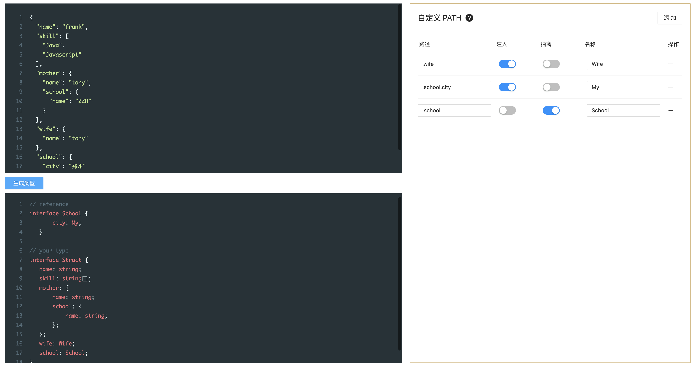

## 1. 介绍

从 json data 生成对应的 interface，如果你的公司没有使用类似 swigger 这种对参数做严格管理的工具，那么使用 data-to-interface 会方便。

它的路径配置，可以很方便的管理复杂的类型。

## 2. 演示

输入
```json
{
  "name": "frank",
  "skill": [
    "Java",
    "Javascript"
  ]
}
```

输出
```ts
interface Model {
  name: string;
  skill: string[];
}
```

## 3. 缺点

只能处理JSON中的数据类型：`{}` `string` `number` `Array`，如果是其他类型需要使用自定义path。比如 枚举、函数、自定义类型以及 类型修饰符 `readonly optional` 等等。

## 4、screenshot

